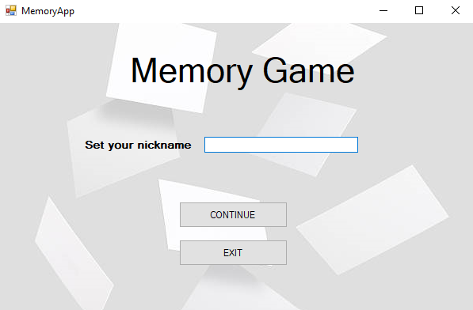
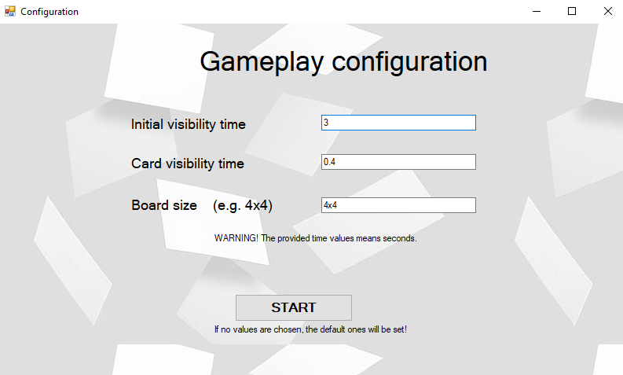
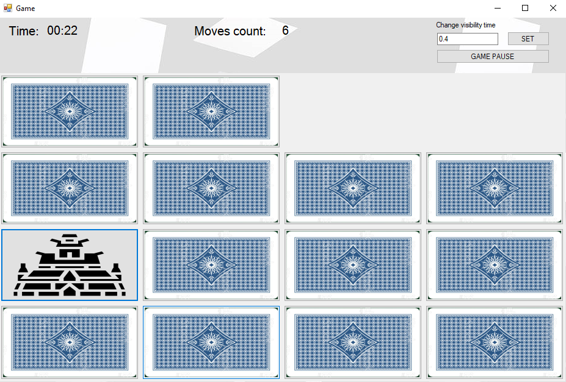
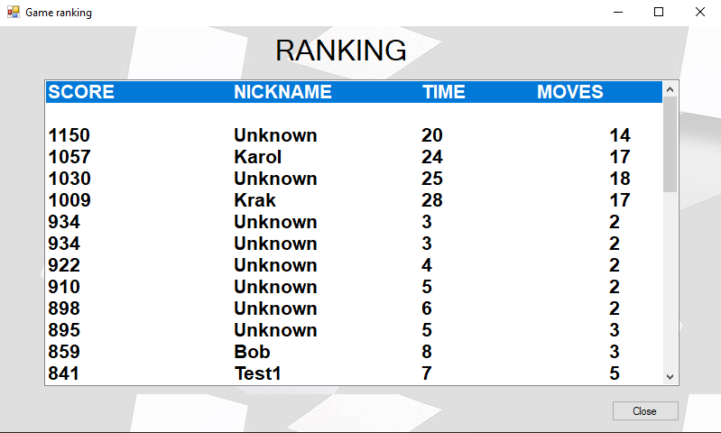

<h1 align="center">  Memory Game 

[](https://dotnet.microsoft.com/) [](https://visualstudio.microsoft.com/)

## Table of contents

> ### 1. [Description](#description)
> ### 2. [Setup](#initial-setup)
> ### 3. [Technologies used](#technologies-used)
> ### 4. [App overview](#overview)


## Description  <a name="description"></a>
[Memory](https://en.wikipedia.org/wiki/Concentration_(card_game)) Game is a card game in which all the cards are laid face down on a surface and two cards are flipped face up over each turn. The object of the game is to turn over pairs of matching cards.
When all cards are paired and revealed the game ends and the final score is calculated.
After ended game ranking is shown where you can see scores of all played games.

Game is customizable, user can choose f.e. initial visibility time, card visibility time (after picking), board size (f.e. 4x4).

####  Game score formula:
```javascript
score = 100 * number_of_cards_on_board - (game_time * 12 + moves_count * 15)
```

## Setup  <a name="initial-setup"></a>

1. Install .NET (if not installed already).
2. Run the app from the Visual Studio or build the project and run the created executable file.

## Technologies used <a name="technologies-used"></a>

| Technologies                                          |
|:------------------------------------------------------|
| [.NET Framework 4.7.2](https://dotnet.microsoft.com/) |

## App overview  <a name="overview"></a>
<p align="center">
  
</p>
<figcaption align = "center"><b>Welcome screen</b></figcaption>

<p align="center">
  
</p>
<figcaption align = "center"><b>Configuration panel</b></figcaption>

<p align="center">
  
</p>
<figcaption align = "center"><b>Game</b></figcaption>


<p align="center">
  
</p>
<figcaption align = "center"><b>Ranking</b></figcaption>

