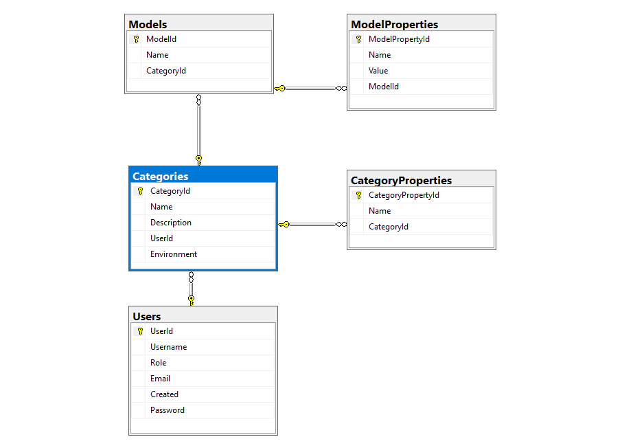
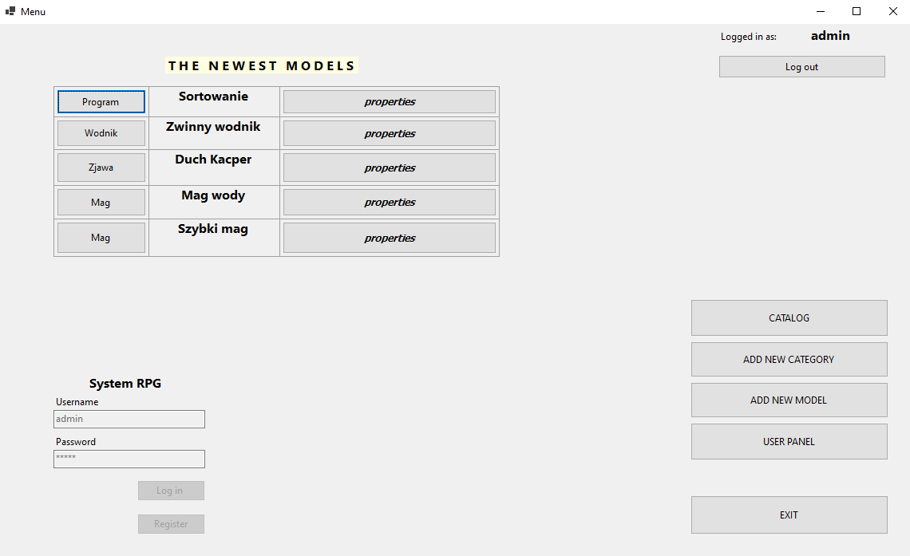
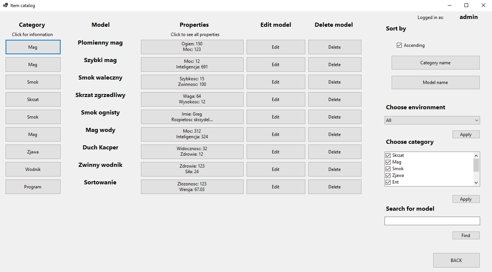
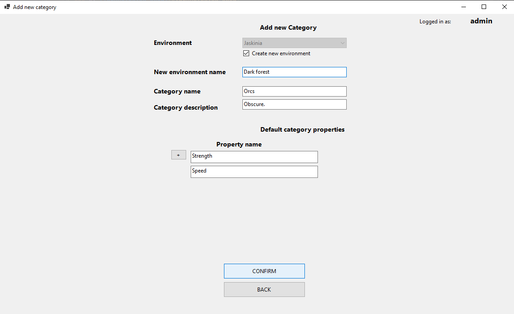
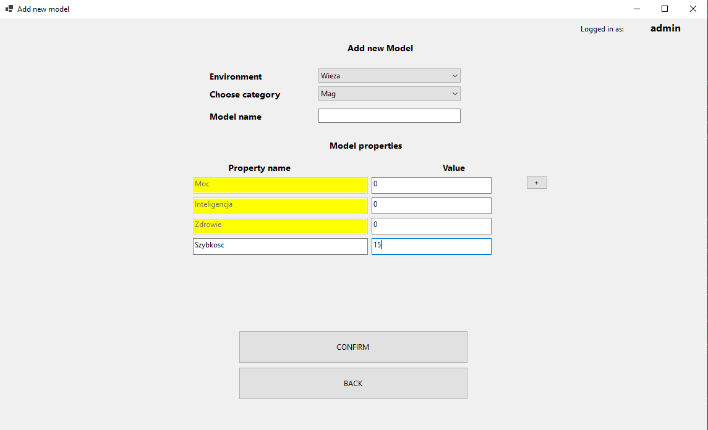
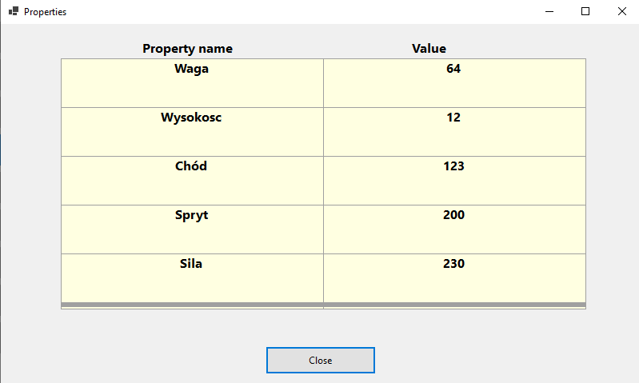
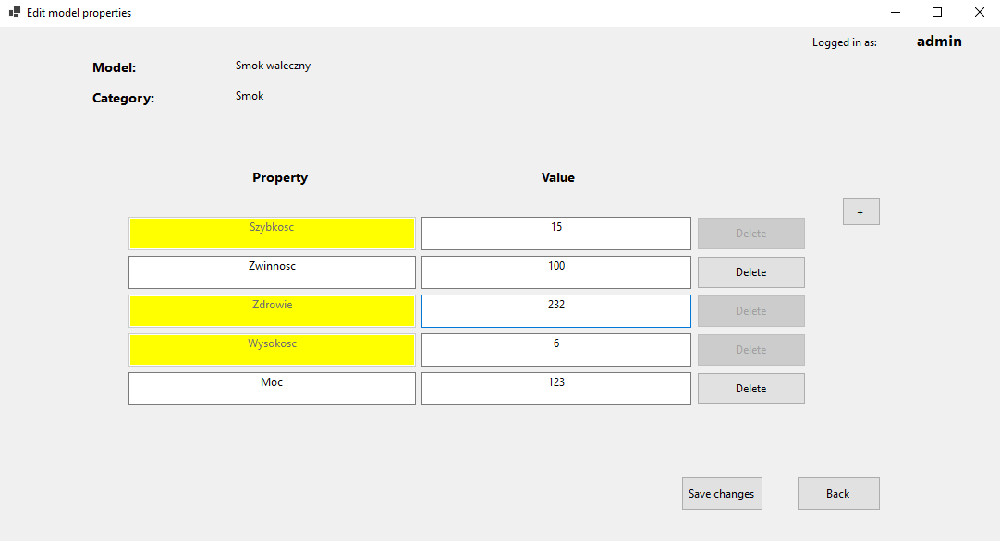
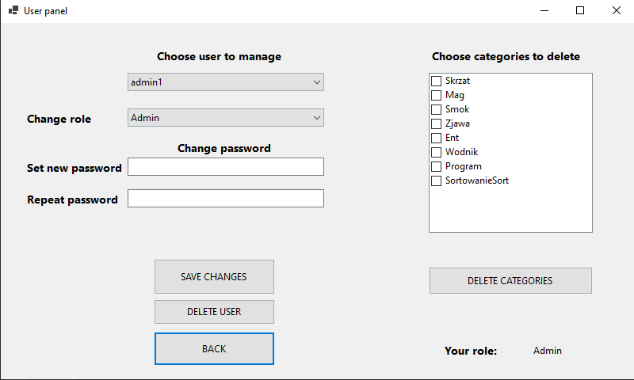

<h1 align="center">  RPG Models Management System 

 

## Table of contents

> ### 1. [Description](#description)
> ### 2. [Setup](#initial-setup)
> ### 3. [Database structure](#database-struct)
> ### 4. [Technologies used](#technologies-used)
> ### 5. [App overview](#overview)

## Description  
**RPG Models Management System** is a great choice for all RPG game fans. 

This application can store RPG game models. Users can share their models in the common database.
The models stored in application have **tree structure** (User -> Categories -> Models).
Each user can create Categories. To created Category user can add models. 
Users can add models only to theirs categories.
Each Category can have predefined properties which models must fulfill in order to belong to it.

Application contains custom user management system with roles.  
Only Admin, Moderators or Category owners can delete models - your models are safe.

Database is created with the `Code first` approach and `Entity Framework`.
## Setup  

1. Install .NET and MySQL (if not installed already).
2. Create db by following those steps:
    1. Open Package Manager Console ([help](/Others/how_to_open_PM.png)).
    2. Create migration (`PM> add-migration createDatabase`).
    3. Update database (`PM> update-database`).
    4. Add admin to the Users table (he cannot be created from the app level).
3. Run the app from the Visual Studio or build the project and run the created executable file.

## Database structure 
The database was managed with Microsoft SQL Server Management Studio.

  

## Technologies used 

| Technologies                                          |
|:------------------------------------------------------|
| [.NET Framework 4.7.2](https://dotnet.microsoft.com/) |
| [MySQL](https://www.mysql.com/)                       |

## App overview  

  

<figcaption align = "center"><b>Welcome screen</b></figcaption>
 
 
 

  

<figcaption align = "center"><b>Model catalog</b></figcaption>
 
 
 

  

<figcaption align = "center"><b>Add category form</b></figcaption>
 
 
 

  

<figcaption align = "center"><b>Add model form  (yellow properties are inherited from the catalog)</b></figcaption>
 
 
 

  

<figcaption align = "center"><b>Model properties table</b></figcaption>
 
 
 

  

<figcaption align = "center"><b>Edit model properties (yellow properties are inherited from the catalog and can't be deleted)</b></figcaption>
 
 
 

  

<figcaption align = "center"><b>User management panel</b></figcaption>

