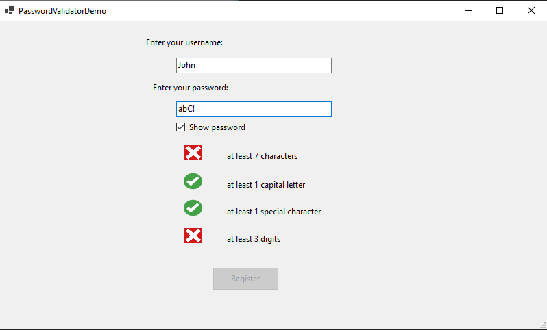

<h1 align="center">  Password Validator

 

## Table of contents

> ### 1. [Description](#description)
> ### 2. [Setup](#initial-setup)
> ### 3. [Technologies used](#technologies-used)
> ### 4. [App overview](#overview)

## Description  
Password Validator is responsible for determining whether a proposed password is acceptable for use and could include checks.

By default, password must contain at least
   *  7 characters
   *  1 capital letter
   *  1 special character
   *  3 digits

Conditions are easily configurable and can be turned off.

## Setup  

1. Install .NET (if not installed already).
2. Run the app from the Visual Studio or build the project and run the created executable file.
   * Control is stored in the `PasswordValidatorControl`
   * Test application is stored in the `TestPasswordValidator`

## Technologies used 

| Technologies                                          |
|:------------------------------------------------------|
| [.NET Framework 4.7.2](https://dotnet.microsoft.com/) |

## App overview  

  

<figcaption align = "center"><b>No conditions met</b></figcaption>
 
 
 

  

<figcaption align = "center"><b>Only part of the conditions met</b></figcaption>
 
 
 

  

<figcaption align = "center"><b>All conditions met, password accepted</b></figcaption>
